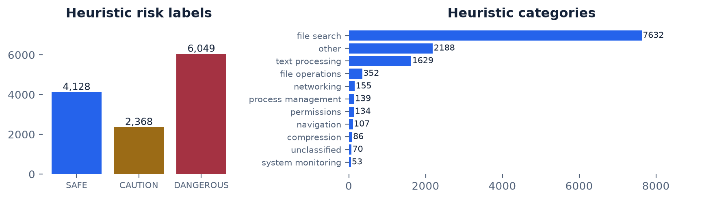
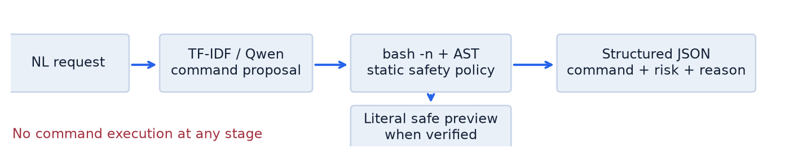
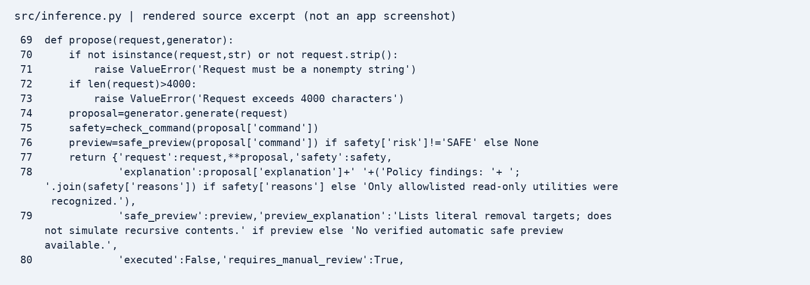
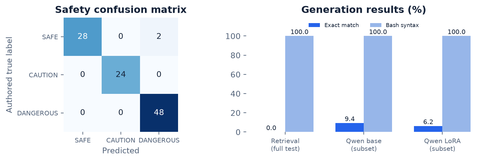

# ShellForge - Review 2

Measured original cloud pilot; full-data GPU continuation status is stated explicitly. Source snapshot: ad24e3dc045fadacca75f796b99107b7072a60a6. Branch: codex/review2-cloud.

## 1. Dataset

The original NL2Bash corpus has 12,607 natural-language lines and 12,607 command lines. The repository also has 20 curated records, a 100-row import, 120-row pilot and old 96/12/12 splits. All original data and Review 1 documentation were preserved. Review 2 ingested 12,967 occurrences across the corpus and original JSONL files. Count equality and source SHA-256 hashes establish positional consistency, not universal semantic alignment. Original risk annotations remain unverified; independently verified corpus risk labels: 0.

## 2. Dataset Preprocessing

Typed JSON validation rejects malformed objects, missing/non-string/empty required fields and NULs. Command bytes, case, quotes and internal spacing are preserved. Syntax checks use Bash parse-only mode with a clean environment. Removed 348 duplicate occurrences and 74 syntax-invalid occurrences; retained 12,545. Connected components isolate shared normalized instructions, AST literal quote/spacing equivalents and known additive ls/rm flag variants. Seed 42 yields 9,328 groups (largest 45); splits 10,036/1,255/1,254. All checked cross-split overlaps are zero. Arbitrary semantic paraphrase leakage is not ruled out. Follow-up training-only audit retained 10,026/10,036 examples; additional exclusions 10. A 100-pair assistant static review identified ten wrong paths, time predicates, unsupported tasks or unintended actions; labels are not externally adjudicated. Original split membership and held-out bytes remain unchanged.

## 3. Code Implementation

A training-only character TF-IDF retrieval baseline and optional Qwen Transformers generator feed the same static validator and structured JSON CLI. The validator handles deletion flag variants, find actions, file truncation, formatting, privilege changes, broad permissions, termination, wrappers, interpreters, substitutions and dangerous pipelines. Unknown utilities require review; unsupported shell constructs fail closed. A preview is emitted only for simple literal recursive rm and is revalidated as read-only. Other cases explicitly return no verified preview. Every response records executed=false and requires manual review. Completed a small CPU LoRA pilot: 20 optimizer steps, rank 8, alpha 16, q_proj/v_proj; 540,672 trainable parameters (0.1093%). Used 128 of 128 selected training examples; 0 exceeded the 192-token limit. Validation loss: 1.3759. This is a feasibility run, not a fully trained production model.

## 4. Metrics - Results and Discussion

Generation is evaluated on held-out requests using strict command-byte exact match and Bash -n syntax validity. The retrieval baseline has 0.00% exact match on 1254 cases; command grouping intentionally prevents memorized command overlap. Its 100.00% syntax validity reflects copying valid training commands, not task correctness. Qwen base/LoRA comparisons, when present, use the same deterministic 32-record held-out subset, not the full test. Safety uses 102 separately authored cases with operation-based labels, never validator-generated truth. Final macro F1 is 0.9817; dangerous false negatives: 0. This benchmark was used to refine the policy and is not an untouched generalization set. Labels are assistant-authored, not external expert consensus. No command execution or semantic correctness percentage is claimed. On the same 32 requests, Qwen base exact match was 9.38%, versus 6.25% for LoRA. The small fine-tuning run did not improve exact match; this subset is too small for a robust generalization claim.

| Model / evaluation scope | n | Exact match | Bash syntax |
| --- | --- | --- | --- |
| TF-IDF 1-NN / full test | 1254 | 0.00% | 100.00% |
| Qwen base / subset | 32 | 9.38% | 100.00% |
| Qwen LoRA / same subset | 32 | 6.25% | 100.00% |

| Safety class | Precision | Recall | F1 | Support |
| --- | --- | --- | --- | --- |
| SAFE | 1.000 | 0.933 | 0.966 | 30 |
| CAUTION | 1.000 | 1.000 | 1.000 | 24 |
| DANGEROUS | 0.960 | 1.000 | 0.980 | 48 |

Example (exact-match success): Make directory "temp"
Reference: `mkdir temp`
Prediction: `mkdir temp`

Example (exact-match failure): Find all files starting from the current directory which are exactly 100MB in size
Reference: `find . -size 100M`
Prediction: `find . -size +100M`

## 5. What Went Wrong

The original importer could silently truncate unequal files; old random splits leaked shared commands/instructions. Retrieval produced zero held-out exact matches, showing its inability to synthesize unseen commands. The initial safety benchmark missed date -s and chmod ugo=rwx (two dangerous false negatives); both were fixed while preserving initial scores. Two harmless compound examples remain rejected by the conservative policy. Direct git clone failed authentication; connector access recovered the repository. Initial model-client dependencies were incompatible with the available proxy; pinned compatible versions resolved access. An initial training run was interrupted to finalize stronger split equivalence, then restarted on final artifacts. The 20-step CPU pilot uses very little data and cannot establish robust model quality. LoRA exact match decreased from 3/32 to 2/32; a completed training run is not proof of improvement. No full-data GPU training has been executed in the prepared continuation; no new accuracy or loss is claimed.

## 6. Alternative Flow / Proposed Improvements

Prepared cloud protocol: restore split hashes; audit training only; up to 3 epochs, rank 16 attention/MLP LoRA, batch 16, 512 tokens, seed 42, LR trials 1e-4/5e-5, cosine decay and 5% warmup. Save/evaluate every 100 steps, patience 3. Select by full-validation exact match, then loss; freeze before paired test. No GPU completion is claimed until manifests exist. Primary test: 1,222 cases unexposed to the old pilot; full 1,254 results disclose 32 exposed cases. Future work: adjudicate semantic alignment and safety labels, review command equivalence, compare each larger model against its own base, and calibrate abstention. AST similarity never proves semantics. Keep execution disabled.

## Verification and reproduction

48 passed, 7 warnings in 15.43s

See README.md for exact cloud commands. See reports/logs/commands.txt, data/review2/stats.json, reports/metrics/ and artifacts/qwen-lora/training_manifest.json for detailed evidence.

References: NL2Bash, Lin et al. (2018), https://github.com/TellinaTool/nl2bash; Qwen2.5-0.5B-Instruct model card, https://huggingface.co/Qwen/Qwen2.5-0.5B-Instruct; LoRA, Hu et al. (2021), https://arxiv.org/abs/2106.09685. Model revision: 7ae557604adf67be50417f59c2c2f167def9a775.
